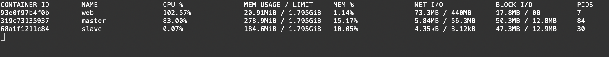
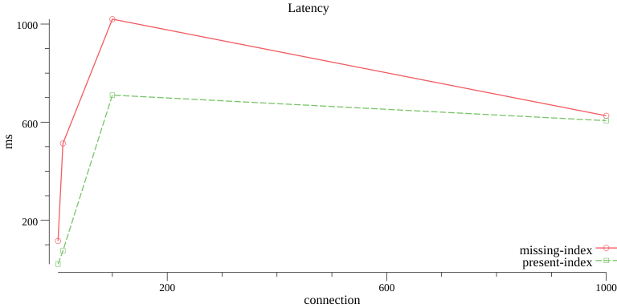

## Social network 

### TASK4
Обеспечить возможность переключения master на другую машину без потери транзакций

Используется master и два слейва. Для сохрание записей после сбоя настраиваю Semisynchronous Replication

#### Master semi_sync 

- Установил plugin semisync_master.so 
- Включил semi_sync репликацию AFTER_SYNC(default) 
- Установил timeout ожидания записи на слейв 1s 
- Проверил статус
```mysql
INSTALL PLUGIN rpl_semi_sync_master SONAME 'semisync_master.so';
SET GLOBAL rpl_semi_sync_master_enabled = 1;
SET GLOBAL rpl_semi_sync_master_timeout = 1000;
```

```shell script
mysql> show master status;
+------------------+----------+--------------+------------------+---------------------------------------------+
| File             | Position | Binlog_Do_DB | Binlog_Ignore_DB | Executed_Gtid_Set                           |
+------------------+----------+--------------+------------------+---------------------------------------------+
| mysql-bin.000002 |      645 | soc_db       |                  | cc6a271c-fda5-11e9-bc17-0242ac1c0002:1-4068 |
+------------------+----------+--------------+------------------+---------------------------------------------+

mysql> SHOW VARIABLES LIKE 'rpl_semi_sync%';
+-------------------------------------------+------------+
| Variable_name                             | Value      |
+-------------------------------------------+------------+
| rpl_semi_sync_master_enabled              | ON         |
| rpl_semi_sync_master_timeout              | 10000      |
| rpl_semi_sync_master_trace_level          | 32         |
| rpl_semi_sync_master_wait_for_slave_count | 1          |
| rpl_semi_sync_master_wait_no_slave        | ON         |
| rpl_semi_sync_master_wait_point           | AFTER_SYNC |
+-------------------------------------------+------------+
6 rows in set (0.01 sec)

mysql> SHOW STATUS LIKE 'Rpl_semi_sync%';
+--------------------------------------------+-------+
| Variable_name                              | Value |
+--------------------------------------------+-------+
| Rpl_semi_sync_master_clients               | 2     |
| Rpl_semi_sync_master_net_avg_wait_time     | 0     |
| Rpl_semi_sync_master_net_wait_time         | 0     |
| Rpl_semi_sync_master_net_waits             | 0     |
| Rpl_semi_sync_master_no_times              | 0     |
| Rpl_semi_sync_master_no_tx                 | 0     |
| Rpl_semi_sync_master_status                | ON    |
| Rpl_semi_sync_master_timefunc_failures     | 0     |
| Rpl_semi_sync_master_tx_avg_wait_time      | 0     |
| Rpl_semi_sync_master_tx_wait_time          | 0     |
| Rpl_semi_sync_master_tx_waits              | 0     |
| Rpl_semi_sync_master_wait_pos_backtraverse | 0     |
| Rpl_semi_sync_master_wait_sessions         | 0     |
| Rpl_semi_sync_master_yes_tx                | 0     |
+--------------------------------------------+-------+
14 rows in set (0.00 sec)

mysql> SHOW PROCESSLIST;
+----+------------+------------------+--------+------------------+------+---------------------------------------------------------------+------------------+
| Id | User       | Host             | db     | Command          | Time | State                                                         | Info             |
+----+------------+------------------+--------+------------------+------+---------------------------------------------------------------+------------------+
|  2 | root       | localhost        | soc_db | Query            |    0 | starting                                                      | SHOW PROCESSLIST |
|  5 | soc_user   | 172.28.0.8:33858 | soc_db | Sleep            |  565 |                                                               | NULL             |
|  6 | slave_user | 172.28.0.7:56680 | NULL   | Binlog Dump GTID |  267 | Master has sent all binlog to slave; waiting for more updates | NULL             |
|  7 | slave_user | 172.28.0.6:50174 | NULL   | Binlog Dump GTID |  263 | Master has sent all binlog to slave; waiting for more updates | NULL             |
+----+------------+------------------+--------+------------------+------+---------------------------------------------------------------+------------------+
4 rows in set (0.00 sec)

```

#### Slave semi_sync

- Установил plugin на slave1, slave2
- Включил semi_sync репликацию 
- Перегрузил io thread 
- Проверил статус

```mysql
SET @@GLOBAL.read_only = ON;
INSTALL PLUGIN rpl_semi_sync_slave SONAME 'semisync_slave.so';
SET GLOBAL rpl_semi_sync_slave_enabled = 1;
STOP SLAVE IO_THREAD;
START SLAVE IO_THREAD;
```

```shell script
mysql> SHOW VARIABLES LIKE 'rpl_semi_sync%';
+---------------------------------+-------+
| Variable_name                   | Value |
+---------------------------------+-------+
| rpl_semi_sync_slave_enabled     | ON    |
| rpl_semi_sync_slave_trace_level | 32    |
+---------------------------------+-------+
2 rows in set (0.00 sec)

mysql> SHOW STATUS LIKE 'Rpl_semi_sync%';
+----------------------------+-------+
| Variable_name              | Value |
+----------------------------+-------+
| Rpl_semi_sync_slave_status | ON    |
+----------------------------+-------+
1 row in set (0.02 sec)

mysql> show slave status \G
Slave_IO_Running: Yes
Slave_SQL_Running: Yes
Retrieved_Gtid_Set: cc6a271c-fda5-11e9-bc17-0242ac1c0002:1-4068
Executed_Gtid_Set: cc6a271c-fda5-11e9-bc17-0242ac1c0002:1-4068
```

#### Убиваю мастер
- Запускаем запись данных в 2 потока
- docker kill --signal=SIGKILL master

##### Состояние обоих slave по после смерти master одинаковое и любой может стать мастером
```shell script
show slave status \G
Retrieved_Gtid_Set: cc6a271c-fda5-11e9-bc17-0242ac1c0002:1-5346
Executed_Gtid_Set: cc6a271c-fda5-11e9-bc17-0242ac1c0002:1-5346
mysql> select count(*) from users;
+----------+
| count(*) |
+----------+
|  1019824 |
+----------+
1 row in set (0.11 sec)
```

### Slave Promotion
```mysql
STOP SLAVE;
CHANGE MASTER TO MASTER_HOST = ' ';
INSTALL PLUGIN rpl_semi_sync_master SONAME 'semisync_master.so';
SET GLOBAL rpl_semi_sync_slave_enabled = 0;
SET GLOBAL rpl_semi_sync_master_enabled = 1;
SET GLOBAL rpl_semi_sync_master_timeout = 1000;
GRANT REPLICATION SLAVE ON *.* TO 'slave_user'@'%' IDENTIFIED BY 'qwerty';
FLUSH PRIVILEGES;
RESET MASTER;
```

переключаем slave2 на slave1
```mysql
STOP SLAVE;
CHANGE MASTER TO MASTER_HOST = 'slave1', MASTER_PORT = 3306,  MASTER_USER = 'slave_user', MASTER_PASSWORD = 'qwerty', MASTER_AUTO_POSITION = 1;
START SLAVE;
SET GLOBAL read_only = OFF;
```
```shell script
mysql> show slave status \G
Slave_IO_Running: Yes
Slave_SQL_Running: Yes
Executed_Gtid_Set: cc6a271c-fda5-11e9-bc17-0242ac1c0002:1-5346,
```

ссотяние мастера
```shell script
mysql> SHOW PROCESSLIST;
+------+------------+------------------+--------+------------------+------+---------------------------------------------------------------+------------------+
| Id   | User       | Host             | db     | Command          | Time | State                                                         | Info             |
+------+------------+------------------+--------+------------------+------+---------------------------------------------------------------+------------------+
|    5 | root       | localhost        | soc_db | Query            |    0 | starting                                                      | SHOW PROCESSLIST |
| 1395 | soc_user   | 172.28.0.8:40140 | soc_db | Sleep            | 4200 |                                                               | NULL             |
| 1497 | soc_user   | 172.28.0.8:40762 | soc_db | Sleep            | 2969 |                                                               | NULL             |
| 1634 | slave_user | 172.28.0.6:52440 | NULL   | Binlog Dump GTID |  243 | Master has sent all binlog to slave; waiting for more updates | NULL             |
+------+------------+------------------+--------+------------------+------+---------------------------------------------------------------+------------------+
4 rows in set (0.00 sec)

mysql> SHOW STATUS LIKE 'Rpl_semi_sync%';
+--------------------------------------------+-------+
| Variable_name                              | Value |
+--------------------------------------------+-------+
| Rpl_semi_sync_master_clients               | 1     |
| Rpl_semi_sync_master_net_avg_wait_time     | 0     |
| Rpl_semi_sync_master_net_wait_time         | 0     |
| Rpl_semi_sync_master_net_waits             | 0     |
| Rpl_semi_sync_master_no_times              | 0     |
| Rpl_semi_sync_master_no_tx                 | 0     |
| Rpl_semi_sync_master_status                | ON    |
| Rpl_semi_sync_master_timefunc_failures     | 0     |
| Rpl_semi_sync_master_tx_avg_wait_time      | 0     |
| Rpl_semi_sync_master_tx_wait_time          | 0     |
| Rpl_semi_sync_master_tx_waits              | 0     |
| Rpl_semi_sync_master_wait_pos_backtraverse | 0     |
| Rpl_semi_sync_master_wait_sessions         | 0     |
| Rpl_semi_sync_master_yes_tx                | 0     |
| Rpl_semi_sync_slave_status                 | OFF   |
+--------------------------------------------+-------+
15 rows in set (0.05 sec)
```

Поднимаем убитый мастер и смотрим состояние на момент смерти

#### Выводы:
1) Количестов записей мастера совпадает с количестовм записей слейвов
```shell script
mysql> select count(*) from users;
+----------+
| count(*) |
+----------+
|  1019824 |
+----------+
1 row in set (0.30 sec)
```
2) Executed_Gtid мастера в момент падения совпадает с Executed_Gtid [слейвов](https://github.com/ios116/social/blob/master/README.md#%D1%81%D0%BE%D1%81%D1%82%D0%BE%D1%8F%D0%BD%D0%B8%D0%B5-%D0%BE%D0%B1%D0%BE%D0%B8%D1%85-slave-%D0%BF%D0%BE-%D0%BF%D0%BE%D1%81%D0%BB%D0%B5-%D1%81%D0%BC%D0%B5%D1%80%D1%82%D0%B8-master-%D0%BE%D0%B4%D0%B8%D0%BD%D0%B0%D0%BA%D0%BE%D0%B2%D0%BE%D0%B5-%D0%BB%D1%8E%D0%B1%D0%BE%D0%B9-%D0%BC%D0%BE%D0%B6%D0%B5%D1%82-%D1%81%D1%82%D0%B0%D1%82%D1%8C-%D0%BC%D0%B0%D1%81%D1%82%D0%B5%D1%80%D0%BE%D0%BC)
```shell script
mysql> show master status;
+------------------+----------+--------------+------------------+---------------------------------------------+
| File             | Position | Binlog_Do_DB | Binlog_Ignore_DB | Executed_Gtid_Set                           |
+------------------+----------+--------------+------------------+---------------------------------------------+
| mysql-bin.000003 |      194 | soc_db       |                  | cc6a271c-fda5-11e9-bc17-0242ac1c0002:1-5346 |
+------------------+----------+--------------+------------------+---------------------------------------------+
1 row in set (0.00 sec)
````

Вывод транзакции не потерялись


### TASK3

#### Добавить m/s репликацию. Сделать балансирование запросов на чтение. Провести нагрузочное тестирование

- конфиг мастера
```
# master
server-id = 1 # идентификатор мастер сервера
binlog_do_db = soc_db # база для репликации
gtid_mode=ON # включает GTID
binlog_format = ROW # формат ведения журнала row base
log_bin=mysql-bin # Ведение бинарного лога для мастера (с него читает слейв).
enforce-gtid-consistency=ON
```
- конфиг слейва
```
#salve
binlog_do_db = soc_db # база для репликации
server_id = 2  # идентификатор slave сервера
binlog_format = ROW # формат ведения журнала row base
gtid_mode = on # GTID mod
enforce_gtid_consistency
read-only=on # только в режиме чтения
```

На мастере создан пользователь для реплики
```mysql
GRANT REPLICATION SLAVE ON *.* TO 'slave_user'@'%' IDENTIFIED BY 'qwerty';
FLUSH PRIVILEGES;
```
На слейве указан мастер
```mysql
CHANGE MASTER TO MASTER_HOST = 'master', MASTER_PORT = 3306,  MASTER_USER = 'slave_user', MASTER_PASSWORD = 'qwerty', MASTER_AUTO_POSITION = 1;
START SLAVE;
```

**В коде**

Создано два подключения к [master и slave](https://github.com/ios116/social/tree/master/social/internal/config)
Запрос на чтение берет конфиг именно [слейва](https://github.com/ios116/social/blob/master/social/internal/storage/users/user.go#L164) 

Нагрузка на чтение
```wrk -c 200 -t 16 -d 30s "http://212.109.223.229/search?query=Tomas"```

1) В случае где запросы на чтение идут на master:



2) В случае где запросы на чтение идут на slave

 

### Task2
#### Сгенерировать случайные страницы для проекта социальной сети

**Без индекса**
```mysql
explain SELECT id, first_name, last_name, city FROM users WHERE id>22481 AND (first_name LIKE 'tom%' or last_name LIKE 'tom%') ORDER BY id ASC LIMIT 201;
```
```shell script
+----+-------------+-------+------------+-------+---------------+---------+---------+------+--------+----------+-------------+
| id | select_type | table | partitions | type  | possible_keys | key     | key_len | ref  | rows   | filtered | Extra       |
+----+-------------+-------+------------+-------+---------------+---------+---------+------+--------+----------+-------------+
|  1 | SIMPLE      | users | NULL       | range | PRIMARY,id    | PRIMARY | 8       | NULL | 472495 |    20.99 | Using where |
+----+-------------+-------+------------+-------+---------------+---------+---------+------+--------+----------+-------------+
```
```json
 {
  "query_block": {
    "select_id": 1,
    "cost_info": {
      "query_cost": "189809.78"
    },
    "ordering_operation": {
      "using_filesort": false,
      "table": {
        "table_name": "users",
        "access_type": "range",
        "possible_keys": [
          "PRIMARY",
          "id"
        ],
        "key": "PRIMARY",
        "used_key_parts": [
          "id"
        ],
        "key_length": "8",
        "rows_examined_per_scan": 472495,
        "rows_produced_per_join": 99156,
        "filtered": "20.99",
        "cost_info": {
          "read_cost": "169978.52",
          "eval_cost": "19831.26",
          "prefix_cost": "189809.78",
          "data_read_per_join": "511M"
        },
        "used_columns": [
          "id",
          "city",
          "first_name",
          "last_name"
        ],
        "attached_condition": "((`soc_db`.`users`.`id` > 22481) and ((`soc_db`.`users`.`first_name` like 'tom%') or (`soc_db`.`users`.`last_name` like 'tom%')))"
      }
    }
  }
}
```

**С индексом**
```mysql
create index f on users(first_name);
create index l on users(last_name);
explain SELECT id, first_name, last_name, city FROM users WHERE id>22481 AND (first_name LIKE 'tom%' or last_name LIKE 'tom%') ORDER BY id ASC LIMIT 201;
```
```shell script
+----+-------------+-------+------------+-------------+----------------+------+---------+------+------+----------+----------------------------------------------------+
| id | select_type | table | partitions | type        | possible_keys  | key  | key_len | ref  | rows | filtered | Extra                                              |
+----+-------------+-------+------------+-------------+----------------+------+---------+------+------+----------+----------------------------------------------------+
|  1 | SIMPLE      | users | NULL       | index_merge | PRIMARY,id,l,f | f,l  | 768,768 | NULL | 1346 |    50.00 | Using sort_union(f,l); Using where; Using filesort |
+----+-------------+-------+------------+-------------+----------------+------+---------+------+------+----------+----------------------------------------------------+
```

```json
{
  "query_block": {
    "select_id": 1,
    "cost_info": {
      "query_cost": "4317.85"
    },
    "ordering_operation": {
      "using_filesort": true,
      "table": {
        "table_name": "users",
        "access_type": "index_merge",
        "possible_keys": [
          "PRIMARY",
          "id",
          "f",
          "l"
        ],
        "key": "sort_union(f,l)",
        "key_length": "768,768",
        "rows_examined_per_scan": 1346,
        "rows_produced_per_join": 672,
        "filtered": "50.00",
        "cost_info": {
          "read_cost": "4183.25",
          "eval_cost": "134.60",
          "prefix_cost": "4317.85",
          "data_read_per_join": "3M"
        },
        "used_columns": [
          "id",
          "city",
          "first_name",
          "last_name"
        ],
        "attached_condition": "((`soc_db`.`users`.`id` > 22481) and ((`soc_db`.`users`.`first_name` like 'tom%') or (`soc_db`.`users`.`last_name` like 'tom%')))"
      }
    }
  }
}
```
[wrk tests без индекса](https://github.com/ios116/social/blob/master/social/assets/index_no) | [wrk tests с индексом](https://github.com/ios116/social/blob/master/social/assets/index_yes)




- Индекс выбран не составной, т.к. используется OR если бы AND то лучше работал бы составной.
- Выдача разбивается по страницам по последнему выданному Id + Limit,а не с помощью offset, т.к. чем больше offset тем больше планировщику приходится просчитывать отступ и тем медленне запрос. 
- Чем более селективнее запрос тем лучше работает индекс, т.е индекс при поисковом запросе "tom" будет работать лучше чем при "t".
- Очевидно, что производительность с индексом существенно выше. 
- При 1000 одновременных соединений увеличивается колличество долгих запросов без индекса 17% от 8624, c индексом 20% от 32735. 

### Task1

Tech stack:
- golang
- mysql 5.7
- session JWT
- css bootstrap

[sql](https://github.com/ios116/social/blob/master/social/sql/setup.sql)
